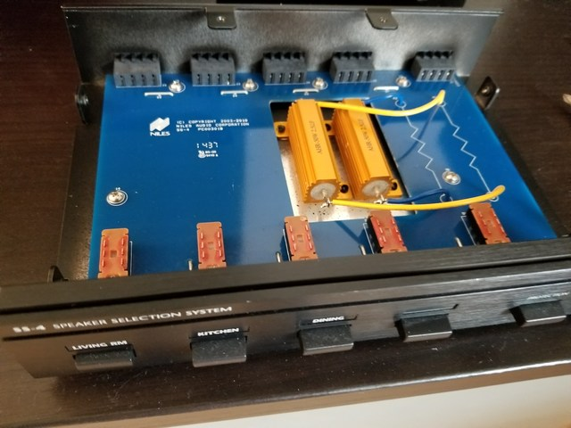
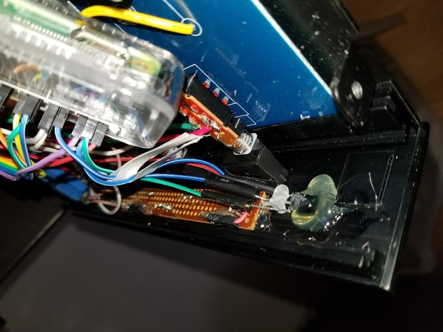
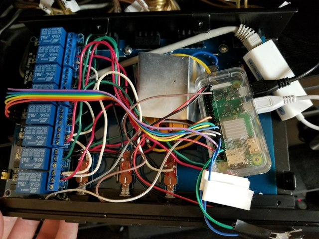
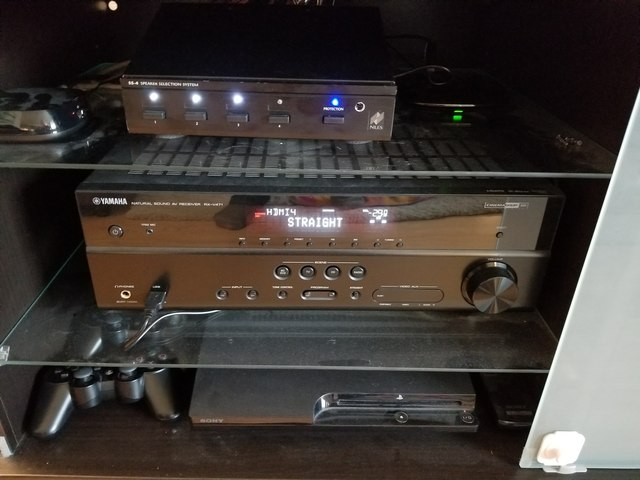

# spkr-select

## Raspberry Pi based Speaker Selector using Python and Flask/Gunicorn/nginx (and optionally LIRC)
##### Also uses Bootstrap (http://getbootstrap.com/) w/jQuery and Popper support

This project was inspired by David Liu and his excellent speaker selector project (http://iceboundflame.com/projects/multi-room-audio-control-with-rpi).  I encourage you to check it out and get a rough idea of how this all works.

This version of the speaker selector script is highly tuned to my particular setup.  I have only three sets of speakers, using the Niles SS4 speaker switch.  I've used relays that I purchased on Amazon.com (https://amzn.com/B00KTELP3I), which are great for this particular project.  If you want a fourth set of speakers to be added, you will need to add a couple relays to support this.    

Since my personal setup will use the living room speakers only, by default, 99% of the time I've set this up as "normally closed" on the relay.  The other three sets of relays can be normally open since they're more rarely used.  This will hopefully save the relays from getting worn out too quickly.

I've added an IR receiver (https://amzn.com/B005T960JC) so that I can also use my universal remote to control the speaker output.  This is likely optional, but a really convenient addition to the project.  The code uses LIRC and Python LIRC to accept input from the IR receiver.

Initially this project used Flask's native WSGI services without Gunicorn or nginx as a proxy.  However, I noticed that after some time, the app would become unresponsive.  After a little research, it appears that Flask's built in web server is for testing purposes only and shouldn't really be used in production.  With that said, I'm using Gunicorn and nginx to proxy web requests.  This is simple enough to configure and setup, however I had to redesign the application without the threading libraries, due to conflicts with Gunicorn.  Instead, I am using two processes running concurrently (control.py and app.py).  Control handles all of the RasPi GPIO interfaces, while App handles the web routes.  They communicate through a .dat file (using pickle to simplify the format).  

#### UPDATE: March 2018

With this update I've done a complete overhaul of the web UI with Bootstrap 4.  I feel that the aesthetics are even better than they were before. I've changed from using the TiTa-Toggle switches to just plain buttons that change their appearance (solid when on, outline white when off) dynamically when set.  

I've also updated the admin screen to include some system information, as well as improve the shutdown & restart buttons.  

I've also changed out the existing Raspberry Pi 2, for a Raspberry Pi Zero W instead.  My hope is that it will run a bit cooler than the RasPi2.  And frankly, the RasPi2 is pretty bulky.  I have added a USB Ethernet dongle to this project, however the wireless does appear to work inside the aluminum box.  

## Screenshots

Here is a screenshot of the dashboard:

Here is a screenshot of the admin screen:

## Hardware Configuration

Someday, I'll get around to posting more about the hardware setup, and possibly a schematic.  For now, check out these pictures...

Niles SS4 speaker switch opened up, and we see that the design is extremely simple:

This is an overhead view of the board, and in particular the big resistors that provide short protection when more than two sets of speakers are enabled.  

This is a view of the solder points on the the switches.

A view of the front panel board with indicator LEDs and the front panel IR sensor, both hot glued to the front of the unit.  

What a rat's nest... from the left, you see the 8 relay board which provides the actual speaker switching.  I've added a bit of shielding to the large resistors int he center of the board.  ON the right you can see the Raspberry Pi Zero W, the brains of the operation.  Then on the far right, I have the USB Ethernet adapter which is completely optional.  

The finished product, all buttoned up and working in my home theater.  Tis a thing of beauty if I do say so myself.  

### Raspberry Pi GPIO Mapping
GPIO17 LED 01 - Speakers 1

GPIO18 LED 02 - Speakers 2

GPIO19 LED 03 - Speakers 3

GPIO20 LED 04 - Not used / connected currently

GPIO21 LED 05 - Protection

GPIO22 Relays (1 & 2) - Speakers 1 (L/R)

GPIO23 Relays (3 & 4) - Speakers 2 (L/R)

GPIO24 Relays (5 & 6) - Speakers 3 (L/R)

GPIO25 Relays (7 & 8) - Protection (L/R)

GPIO02 IR Input (configured in LIRC setup)

## Software Installation:
###NOTE: The install.sh script doesn't work properly.  Please follow the below instructions to install instead.

### Install Python PIP, Flask, Gunicorn, nginx
>sudo apt-get update

>sudo apt-get install python-pip nginx git -y

>git clone https://github.com/nebhead/spkr-select

>sudo pip install gunicorn flask pickle

### Setup nginx to proxy to gunicorn
>sudo rm /etc/nginx/sites-enabled/default # Delete default configuration

>sudo cp spkr-select.nginx /etc/nginx/sites-available/spkr-select # Copy configuration file to nginx

>sudo ln -s /etc/nginx/sites-available/spkr-select /etc/nginx/sites-enabled # Create link in sites-enabled

>sudo service nginx restart # Restart nginx

### LIRC Install and Configuration
>echo "Installing and configuring LIRC... "

>sudo apt-get install lirc python-lirc -y

>echo "lirc_dev" >> /etc/modules

>echo "lirc_rpi gpio_in_pin=02" >> /etc/modules

>echo "dtoverlay=lirc-rpi,gpio_in_pin=02" >> /boot/config.txt  

> Update the following lines in /etc/lirc/lirc_options.conf:

>    driver    = default

>    device    = /dev/lirc0

### Copy LIRC configuration files to /etc/lirc (make sure to include these in the install directory)
>sudo cp hardware.conf /etc/lirc/hardware.conf

>sudo cp lircd.conf /etc/lirc/lircd.conf

>sudo cp lircrc.txt /etc/lirc/.lircrc

>sudo cp lircrc.txt .lircrc

>sudo /etc/init.d/lirc stop

>sudo /etc/init.d/lirc start

### Configure Crontab for boot
>sudo crontab -l > mycron

>echo "@reboot cd /home/pi/spkr-select && sudo sh boot.sh &" >> mycron

>sudo crontab mycron

>rm mycron
