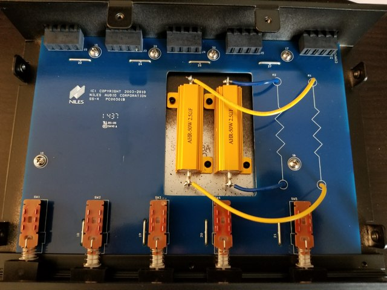
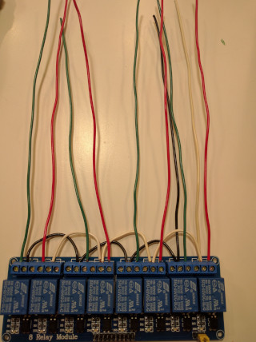
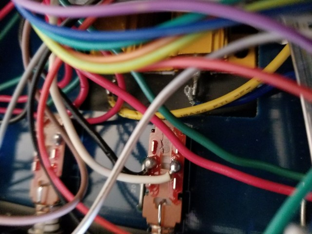
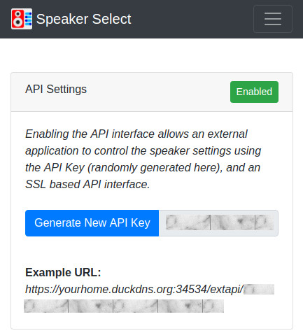
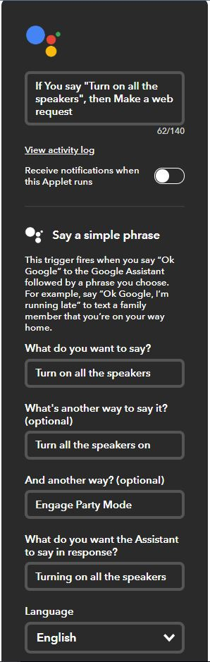
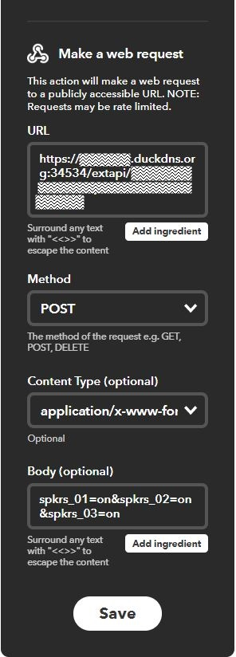
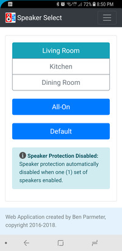
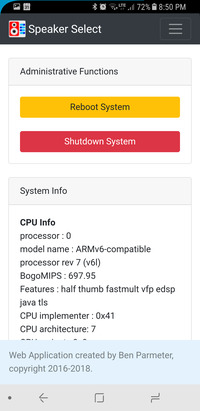
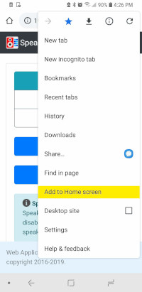
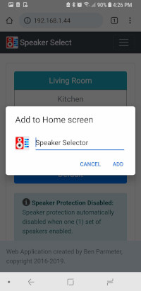

# spkr-select

## Raspberry Pi based Speaker Selector using Python and Flask/Gunicorn/nginx (and optionally LIRC)
##### Also uses Bootstrap (http://getbootstrap.com/) w/jQuery and Popper support

***Note:*** *This project is continuously evolving, and thus this readme will likely be improved over time, as I find the inspiration to make adjustments.  That being said, I'm sure there will be many errors that I have overlooked or sections that I haven't updated.*

This project was inspired by David Liu and his excellent speaker selector project (http://iceboundflame.com/projects/multi-room-audio-control-with-rpi).  I encourage you to check it out and get a rough idea of how this all works.

This version of the speaker selector script is highly tuned to my particular setup.  I have only three sets of speakers, using the Niles SS4 speaker switch.  I've used relays that I purchased on Amazon.com (https://amzn.com/B00KTELP3I), which are great for this particular project.  If you want a fourth set of speakers to be added, you will need to add a couple relays to support this.    

Since my personal setup will use the living room speakers only, by default, 99% of the time I've set this up as "normally closed" on the relay.  The other three sets of relays can be normally open since they're more rarely used.  This will hopefully save the relays from getting worn out too quickly.

I've added an IR receiver (https://amzn.com/B005T960JC) so that I can also use my universal remote to control the speaker output.  This is likely optional, but a really convenient addition to the project.  The code uses LIRC and Python LIRC to accept input from the IR receiver.

Initially this project used Flask's native WSGI services without Gunicorn or nginx as a proxy.  However, I noticed that after some time, the app would become unresponsive.  After a little research, it appears that Flask's built in web server is for testing purposes only and shouldn't really be used in production.  With that said, I'm using Gunicorn and nginx to proxy web requests.  This is simple enough to configure and setup, however I had to redesign the application without the threading libraries, due to conflicts with Gunicorn.  Instead, I am using two processes running concurrently (control.py and app.py).  Control handles all of the RasPi GPIO interfaces, while App handles the web routes.  They communicate through a .dat file (using pickle to simplify the format).  

#### UPDATE: March 2018

With this update I've done a complete overhaul of the web UI with Bootstrap 4.  I feel that the aesthetics are even better than they were before. I've changed from using the TiTa-Toggle switches to just plain buttons that change their appearance (solid when on, outline white when off) dynamically when set.  

I've also updated the admin screen to include some system information, as well as improve the shutdown & restart buttons.  

I've also changed out the existing Raspberry Pi 2, for a Raspberry Pi Zero W instead.  My hope is that it will run a bit cooler than the RasPi2.  And frankly, the RasPi2 is pretty bulky.  I have added a USB Ethernet dongle to this project, however the wireless does appear to work inside the aluminum box.  

#### UPDATE: March 2019

More goodness added to the application including:

* Applications are now managed by supervisord instead of being launched with a CRON script
* Added ability to control application via an HTTPS API (using self-signed certificate and API key) which opens up the ability to use Google Assistant and/or IFTTT to control the speaker states
* Shameless plug for donations (see the admin > credits)

## Screenshots

Here is a screenshot of the dashboard:


Here is a screenshot of the admin screen:


## Hardware Configuration

### The Parts List
The parts list and setup of this was heavily borrowed from the following guide here:
(http://iceboundflame.com/projects/multi-room-audio-control-with-rpi)

* **Raspberry Pi Zero W** - Technically any Raspberry Pi will do fine, but for this application a Raspberry Pi Zero W works really well and is the right price.
* **8-Channel Relay** - I use two relays per set of speakers (left and right channels), and currently don't use the fourth set of speakers. Thus I can use six of the relays for the three sets of speakers and two relays for the speaker protection on the output. [Amazon Link](https://www.amazon.com/dp/B0057OC5WK/ref=cm_sw_em_r_mt_dp_U_TktNCbPC5MVRB)
* **Micro SD Card** - Greater than 4GB is probably good.  
* **MicroUSB Power Adapter** - At least 1 amp current recommended.  Make sure you have a place to plug this in near your garage door opener

** TBD **

### Hardware Setup

**UPDATE 04/2019:** I am currently working on some schematic diagrams for this project and hope to finish them up soon. For now, check out these pictures...

Niles SS4 speaker switch opened up, and we see that the design is extremely simple:


This is an overhead view of the board, and in particular the big resistors that provide short protection when more than two sets of speakers are enabled.  



This is a layout of the wiring for the relays.  From left to right.  The first and second relays are connected in a normally closed configuration, with the wire to the left most position looking at this picture.  The common position on all left speaker and right speaker relays are basically all bussed together.  Meaning that all left speakers would have a common ground and all right speakers have a common ground.  Shown here the black and white wires connecting the respective grounds.  The other relays in this picture are connected up with the normally open configuration because they are typically not enabled.  



This is a view of the solder points on switch number four which is *only* the ground sides (for both left and right) since these are shared for ALL of the switches.  



A view of the front panel board with indicator LEDs and the front panel IR sensor, both hot glued to the front of the unit.  


What a rat's nest... from the left, you see the 8 relay board which provides the actual speaker switching.  I've added a bit of shielding to the large resistors int he center of the board.  ON the right you can see the Raspberry Pi Zero W, the brains of the operation.  Then on the far right, I have the USB Ethernet adapter which is completely optional.  


The finished product, all buttoned up and working in my home theater.  Tis a thing of beauty if I do say so myself.  


### Raspberry Pi GPIO Mapping
GPIO17 LED 01 - Speakers 1

GPIO18 LED 02 - Speakers 2

GPIO19 LED 03 - Speakers 3

GPIO20 LED 04 - Not used / connected currently

GPIO21 LED 05 - Protection

GPIO22 Relays (1 & 2) - Speakers 1 (L/R)

GPIO23 Relays (3 & 4) - Speakers 2 (L/R)

GPIO24 Relays (5 & 6) - Speakers 3 (L/R)

GPIO25 Relays (7 & 8) - Protection (L/R)

GPIO02 IR Input (configured in LIRC setup)

## Software Installation

### Raspberry Pi Zero Setup Headless (*from raspberrypi.org*)

Once you've burned/etched the Raspbian Stretch Lite image onto the microSD card, connect the card to your working PC and you'll see the card being mounted as "boot". Inside this "boot" directory, you need to make 2 new files. You can create the files using Atom code editor.

+ Step 1: Create an empty file. You can use Notepad on Windows or TextEdit to do so by creating a new file. Just name the file **ssh**. Save that empty file and dump it into boot partition (microSD).

+ Step 2: Create another file name wpa_supplicant.conf . This time you need to write a few lines of text for this file. For this file, you need to use the FULL VERSION of wpa_supplicant.conf. Meaning you must have the 3 lines of data namely country, ctrl_interface and update_config

```
country=US
ctrl_interface=DIR=/var/run/wpa_supplicant GROUP=netdev
update_config=1

network={
    ssid="your_real_wifi_ssid"
    scan_ssid=1
    psk="your_real_password"
    key_mgmt=WPA-PSK
}
```

#### Run RasPi-Config
```
ssh pi@192.168.1.xxx

sudo raspi-config
```
+ Set locales
+ Set timezone
+ Replace Hostname with a unique hostname ('i.e. spkr-select')

#### Install Git, Python PIP, Flask, Gunicorn, nginx, and supervisord
```
sudo apt update
sudo apt upgrade
sudo apt install python-pip nginx git gunicorn supervisor -y
sudo pip install flask
sudo pip install pickle
git clone https://github.com/nebhead/spkr-select
```

### Setup nginx to proxy to gunicorn

```
# Move into install directory
cd ~/spkr-select

# Delete default configuration
sudo rm /etc/nginx/sites-enabled/default

# Copy configuration file to nginx
sudo cp spkr-select.nginx /etc/nginx/sites-available/spkr-select

# Create link in sites-enabled
sudo ln -s /etc/nginx/sites-available/spkr-select /etc/nginx/sites-enabled

# Create certificates for SSL support
cd ~/spkr-select/certs
sudo .\generate.sh

# Restart nginx
sudo service nginx restart
```

### Setup Supervisor to Start Apps on Boot / Restart on Failures

```
# Move into garage-zero install directory
cd ~/spkr-select/supervisor

# Copy configuration files (control.conf, webapp.conf) to supervisor config directory
# NOTE: If you used a different directory for garage-zero then make sure you edit the *.conf files appropriately
sudo cp *.conf /etc/supervisor/conf.d/

# If supervisor isn't already running, startup Supervisor
sudo service supervisor start

# If supervisor is running already, just reload the config files
sudo supervisorctl reread
sudo supervisorctl update

# Or just reboot and supervisord should kick everything off
sudo reboot
```
Optionally, you can use supervisor's built in HTTP server to monitor the scripts.

Inside of /etc/supervisor/supervisord.conf, add this:

```
[inet_http_server]
port = 9001
username = user
password = pass
```
If we access our server in a web browser at port 9001, we'll see the web interface that shows the status of the two scripts (WebApp and Control).  This gives you a quick and easy way to monitor whether any of the scripts has stopped functioning.  

### LIRC Install and Configuration

Some configuration may be required for your IR remote control.  I chose an existing remote control schema that I could use with my Logitech Harmony remote.  

```
sudo apt-get install lirc python-lirc -y
echo "lirc_dev" >> /etc/modules
echo "lirc_rpi gpio_in_pin=02" >> /etc/modules
echo "dtoverlay=lirc-rpi,gpio_in_pin=02" >> /boot/config.txt  
```
Update the following lines in /etc/lirc/lirc_options.conf:
```
    driver    = default
    device    = /dev/lirc0
```
Copy LIRC configuration files to /etc/lirc (make sure to include these in the install directory)
```
sudo cp hardware.conf /etc/lirc/hardware.conf
sudo cp lircd.conf /etc/lirc/lircd.conf
sudo cp lircrc.txt /etc/lirc/.lircrc
sudo cp lircrc.txt .lircrc
sudo /etc/init.d/lirc stop
sudo /etc/init.d/lirc start
```

### Set Up Self Signed Cert for External Access (Google Assistant or Alexa and IFTTT Integration)

*Credit to this article for providing details on setting up self signed certificates in nginx. (https://www.humankode.com/ssl/create-a-selfsigned-certificate-for-nginx-in-5-minutes)*

Optionally, you may want to be able to control the speaker selection via Google Assistant or via the IFTTT WebHooks.  I have setup an API interface to allow HTTPS calls to control the speaker settings.  The nginx reverse proxy will allow HTTPS (port 443) calls to be sent to the /extapi application route only.  To avoid having to obtain a certificate from an certificate authority (and potentially have to purchase a domain), I'm providing instructions here how to self-sign a certificate that can be used in conjunction with the nginx webserver. Because the self-signed certificate is only good enough to encrypt traffic between IFTTT and the application, and not to confirm the correct identity of the requester, a shared API key secret must be provided by the service to perform any actions.  

In order to properly use this, you must provide a certificate for nginx to use (see the nginx setup above, where this should be taken care of by default) so that a secure connection can be created between the client and server.  Additionally, an API key should be generated and stored by going to the admin page of the application, and enabling the API interface.  

Additionally, the router must be configured to redirect from an external port (preferably a random port number) to the IP of your speaker-select raspberry pi, and port 443.  This setup will vary from router to router, but this is usually in NAT configuration or Port Forwarding.  

Also, since most of us are on residential internet service, and have IP addresses that are assigned dynamically to our modems, you may want to setup a Dynamic DNS service which assign a simple URL to forward web requests to your IP, and update the IP when it changes.  I won't cover how this works in this guide, however I would recommend that you do some web searches for dynamic DNS.  I would also recommend [DuckDNS](https://duckdns.org) who provide a completely free service for dynamic IP addresses.  It's more bare-bones than something like DynDNS, but free is a pretty good price.  

Once this is setup, you'll want to configure an applet in IFTTT call your API, with your API key and the actions you want to take.  Ensure your IFTTT call is using the HTTPS protocol to protect your API key in transit.  The application should not respond to non-SSL based requests and should only work properly with the correct API key.  No other interfaces are accessible via this API.  

Your API Key can be enabled in the Admin settings page.  You can also regenerate a new key if you'd like by clicking the "Generate New API Key" button.  



#### Setting up IFTTT to work with Speaker Select External Access

Go to https://IFTTT.com and add a new applet.

Select Google Assistant and select "Say a simple phrase and trigger an action"



You will want to use the phrase that you'd like to trigger an action like "Turn on all the speakers." or "Hey Google, Turn off the Kitchen Speakers".

For the THEN action, select WebHooks and fill in as below:



Use the URL that you registered on your dynamic DNS service (for example DuckDNS mentioned above).  Use the port and your API key as generated by the application in the admin screen.  

* **URL:** If you are using a dynamic DNS service or if you are using a doman that you have already registered, you can simply use this to point to your instance.  Example: https://yoursite.duckdns.org:34534/extapi/908ut62kasdj9fuakdjfH  Note that the HTTPS portion of the URL is very important - since regular unsecure HTTP calls will be rejected by this app.   

* **Method:** POST

* **Content Type:** application/x-www-form

* **Body:** This can be any combination of speaker settings either on or off, separated by an ampersand '&'.  For example: spkrs_01=on&spkrs_02=on&spkrs_03=off which would turn Speakers 1 & 2 on and Speakers 3 off.  


#### Additional Notes on Accessing the Application from Outside your Local Network

Please take the utmost care in considering options for exposing this application outside of your home network. Given that this application has very limited security built-in, anyone that is able to gain access to it directly or indirectly, may be able to control your hardware which could result in damage to your property or even potentially physical harm to someone nearby.  

If you want to have access to this application outside of your home network, and I haven't already convinced you not to do this, then I would recommend setting up a VPN for your local network.  This would allow you to tunnel to your home network and access all of your local equipment with some level of security.  A good, low cost, and dead simple VPN project I would recommend is [PiVPN](http://www.pivpn.io/).   

## Using Speaker Select
If you've configured the supervisord correctly, the application scripts should run upon a reboot.  Once the system is up and running, you should be able to access the WebUI via a browser on your smart phone, tablet or PC device.  

Simply navigate to the IP address of your device for example (you can usually find the IP address of your device from looking at your router's configuration/status pages). My router typically assigns IPs with prefixes of 192.168.1.XXX.  I'll use examples on my home network here, so you'll see URLs like: http://192.168.1.42  Yours may look different depending on your routers firmware/manufacturer (i.e. 10.10.0.XXX, etc.)

**Note:** It's highly recommended to set a static IP for your Pi in your router's configuration.  This will vary from manufacturer to manufacturer and is not covered in this guide.  A static IP ensures that you will be able to access your device reliably, without having to check your router for a new IP every so often.   

The interface / webui is broken out into two main pages. The first is the dashboard view where you can check the current status of the speaker selections. Active speakers are highlighted in teal blue.  There are also buttons to select 'All On' which will turn on all speakers, and a button for 'Default', which defaults to the 'Living Room' speakers only.



Pressing the hamburger icon in the upper right of the interface, allows you to also access to the administration screen. This interface allows you to generate an API key for external control via the API, and an API enable selection.  


Scrolling down further gives you the option to reboot the system or shutdown the system.  Below these controls, you'll see more information about the system hardware, and the uptime.  



### Adding Speaker Select to your Homescreen using Chrome on your Android Phone

If you are an Android person, you are likely to be using Chrome on your phone and can not only setup a link to the web-app on your homescreen, but it also makes the interface look like a native application.  Pretty cool right?  Well here's how you set this up, it's very simple.  

First, navigate to the instance of the application in your Chrome browser on your phone.  Remember, it's as easy as going to the IP address that was assigned to you device.  Then, from the Chrome drop-down menu in the upper right of the screen, select "Add to Home screen".  



Then, when the new dialog box pops up, you will have the opportunity to rename the application, or keep the default.



And there you have it, you've not only created a quick link to your web-app, but you've also created a pseudo application at the same time.
